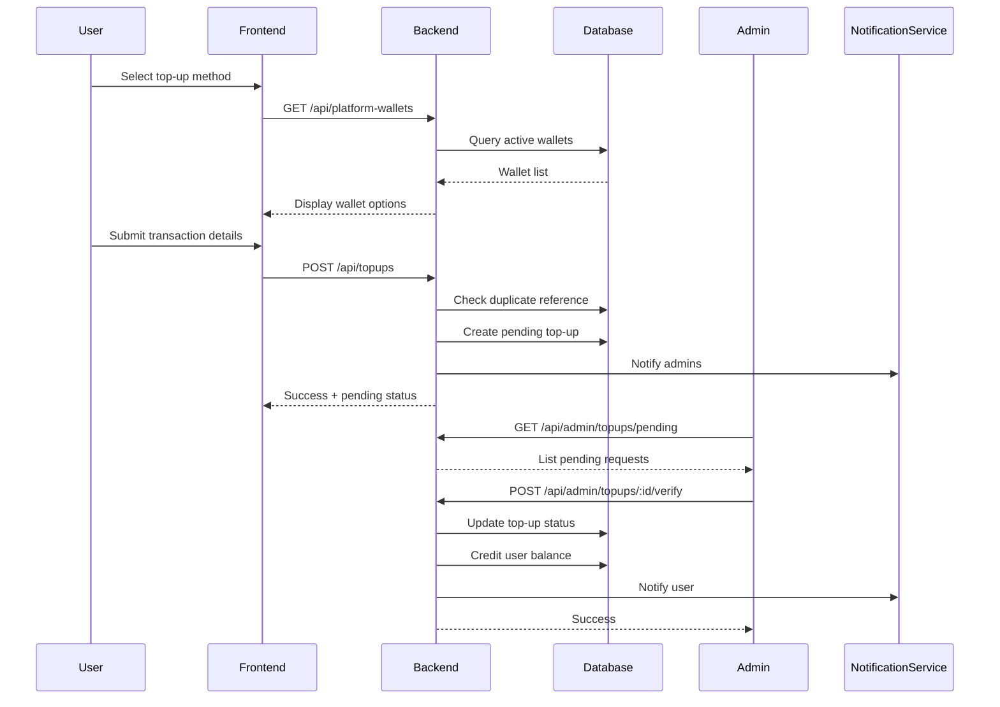

# Design Document: Egypt Payment Production - Phase 1

## Overview

This design document covers Phase 1 of the Egypt Payment Production system: Balance Top-Up and Admin Verification. The system enables users (drivers and customers) to add funds to their platform balance using Egyptian payment methods (Smart Wallets and InstaPay) with manual admin verification.

## Architecture

### High-Level Flow



### System Components

```
┌─────────────────────────────────────────────────────────────────┐
│                         Frontend                                 │
├─────────────────────────────────────────────────────────────────┤
│  TopUpScreen          │  AdminTopUpPanel    │  BalanceDisplay   │
│  - Wallet selection   │  - Pending list     │  - Current balance│
│  - Instructions       │  - Verify/Reject    │  - Transaction    │
│  - Form submission    │  - Filters          │    history        │
└─────────────────────────────────────────────────────────────────┘
                              │
                              ▼
┌─────────────────────────────────────────────────────────────────┐
│                         Backend API                              │
├─────────────────────────────────────────────────────────────────┤
│  topupRoutes.js       │  adminTopupRoutes.js │  walletRoutes.js │
│  - POST /topups       │  - GET /pending      │  - GET /wallets  │
│  - GET /topups/:id    │  - POST /verify      │  - CRUD ops      │
│  - GET /topups/history│  - POST /reject      │                  │
└─────────────────────────────────────────────────────────────────┘
                              │
                              ▼
┌─────────────────────────────────────────────────────────────────┐
│                         Services                                 │
├─────────────────────────────────────────────────────────────────┤
│  topupService.js      │  balanceService.js   │  notificationSvc │
│  - createTopup()      │  - creditBalance()   │  - sendPush()    │
│  - verifyTopup()      │  - getBalance()      │  - notifyAdmins()│
│  - rejectTopup()      │  - getTransactions() │                  │
│  - checkDuplicate()   │                      │                  │
└─────────────────────────────────────────────────────────────────┘
                              │
                              ▼
┌─────────────────────────────────────────────────────────────────┐
│                         Database                                 │
├─────────────────────────────────────────────────────────────────┤
│  topups               │  platform_wallets    │  user_balances   │
│  balance_transactions │  topup_audit_logs    │  notifications   │
└─────────────────────────────────────────────────────────────────┘
```

## Components and Interfaces

### Frontend Components (Existing - To Be Extended)

The following components already exist and will be extended:

1. **BalanceDashboard.tsx** - Main balance view
   - Already shows available/pending/held balance
   - Has deposit/withdraw buttons
   - Shows transaction history
   - No changes needed for Phase 1

2. **DepositModal.tsx** - Multi-step deposit flow
   - Current flow: amount → payment method → processing → success
   - **Phase 1 changes**:
     - Add step for showing platform wallet details
     - Add transaction reference input field
     - Change flow to: amount → wallet selection → transfer instructions → submit reference → pending confirmation

3. **PaymentMethodSelector.tsx** - Payment method selection
   - Currently shows: card, Vodafone Cash, Orange Cash, Etisalat Cash, crypto, COD
   - **Phase 1 changes**:
     - Simplify to 2 options only:
       - **Smart Wallets** (Vodafone Cash, Orange Money, Etisalat Cash, WE Pay) - combined as one entry since they can all send/receive from each other
       - **InstaPay** (bank transfers)
     - Remove card, crypto, COD options (not supported in Phase 1)
     - Show platform wallet number/alias after selection
     - Remove fee calculation (no gateway fees for manual transfers)

4. **AdminDashboard.tsx** - Existing admin panel with sidebar navigation
   - Current tabs: Dashboard, System Health, Analytics, Orders, Couriers, Live Map, Reports, Settings
   - **Phase 1 changes**:
     - Add new "Payments" tab to sidebar
     - Payments tab shows pending top-up requests for verification

5. **New: AdminPaymentsPanel.tsx** - Admin payments verification panel
   - List pending top-up requests with filters
   - Show user info, wallet type, transaction reference, amount
   - Verify/reject buttons with confirmation
   - Badge showing pending count in sidebar

### 1. TopUp Service (New)

```typescript
interface TopupService {
  // Create a new top-up request
  createTopup(data: CreateTopupRequest): Promise<Topup>;

  // Check for duplicate transaction reference
  checkDuplicate(
    reference: string,
    paymentMethod: string,
  ): Promise<Topup | null>;

  // Admin: Verify a pending top-up
  verifyTopup(topupId: string, adminId: string): Promise<Topup>;

  // Admin: Reject a pending top-up
  rejectTopup(topupId: string, adminId: string, reason: string): Promise<Topup>;

  // Get user's top-up history
  getTopupHistory(userId: string, filters?: TopupFilters): Promise<Topup[]>;

  // Get pending top-ups for admin
  getPendingTopups(filters?: AdminTopupFilters): Promise<Topup[]>;
}

interface CreateTopupRequest {
  userId: string;
  amount: number;
  paymentMethod:
    | "vodafone_cash"
    | "orange_money"
    | "etisalat_cash"
    | "we_pay"
    | "instapay";
  transactionReference: string;
  platformWalletId: string;
}

interface Topup {
  id: string;
  userId: string;
  amount: number;
  paymentMethod: string;
  transactionReference: string;
  platformWalletId: string;
  status: "pending" | "verified" | "rejected";
  rejectionReason?: string;
  verifiedBy?: string;
  verifiedAt?: Date;
  createdAt: Date;
  updatedAt: Date;
}
```

### 2. Platform Wallet Service

```typescript
interface PlatformWalletService {
  // Get active wallets for a payment method
  getActiveWallets(paymentMethod?: string): Promise<PlatformWallet[]>;

  // Get wallet by ID
  getWalletById(walletId: string): Promise<PlatformWallet>;

  // Admin: Create new platform wallet
  createWallet(data: CreateWalletRequest): Promise<PlatformWallet>;

  // Admin: Update wallet
  updateWallet(
    walletId: string,
    data: UpdateWalletRequest,
  ): Promise<PlatformWallet>;

  // Admin: Deactivate wallet
  deactivateWallet(walletId: string): Promise<void>;

  // Select best wallet for top-up (round-robin/least-used)
  selectWalletForTopup(paymentMethod: string): Promise<PlatformWallet>;
}

interface PlatformWallet {
  id: string;
  paymentMethod: string;
  phoneNumber?: string; // For smart wallets
  instapayAlias?: string; // For InstaPay
  holderName: string;
  isActive: boolean;
  dailyLimit: number;
  monthlyLimit: number;
  dailyUsed: number;
  monthlyUsed: number;
  createdAt: Date;
  updatedAt: Date;
}
```

### 3. Balance Service (Existing - Extended)

The existing `BalanceService` in `backend/services/balanceService.js` already provides:

```typescript
// Existing methods we will use:
interface BalanceService {
  // Get user's current balance
  getBalance(userId: string): Promise<UserBalance>;

  // Credit balance - will be called after top-up verification
  deposit(dto: DepositDTO): Promise<UserBalance>;

  // Get transaction history with pagination
  getTransactionHistory(
    options: TransactionHistoryOptions,
  ): Promise<TransactionHistoryResult>;

  // Create balance record for new user
  createBalance(userId: string, currency?: string): Promise<UserBalance>;
}

// Existing UserBalance structure:
interface UserBalance {
  userId: string;
  availableBalance: number;
  pendingBalance: number;
  heldBalance: number;
  totalBalance: number;
  currency: string;
  dailyWithdrawalLimit: number;
  monthlyWithdrawalLimit: number;
  minimumBalance: number;
  lifetimeDeposits: number;
  lifetimeWithdrawals: number;
  lifetimeEarnings: number;
  totalTransactions: number;
  isActive: boolean;
  isFrozen: boolean;
  createdAt: Date;
  updatedAt: Date;
}
```

No changes needed to existing BalanceService for Phase 1.

### 4. API Endpoints

#### User Endpoints

```
GET  /api/wallet-payments/wallets/active
     Query: ?paymentMethod=vodafone_cash
     Response: { wallets: PlatformWallet[] }
     Note: REUSE existing endpoint from walletPayments.js

POST /api/topups
     Body: { amount, paymentMethod, transactionReference, platformWalletId }
     Response: { topup: Topup }
     Note: NEW endpoint - different from /api/v1/balance/deposit (topups require admin verification)

GET  /api/topups
     Query: ?status=pending&limit=20&offset=0
     Response: { topups: Topup[], total: number }

GET  /api/topups/:id
     Response: { topup: Topup }

GET  /api/v1/balance/:userId
     Response: { balance: UserBalance }
     Note: REUSE existing endpoint from v1/balance.js

GET  /api/v1/balance/:userId/transactions
     Query: ?type=topup&from=2026-01-01&to=2026-01-31
     Response: { transactions: BalanceTransaction[], total: number }
     Note: REUSE existing endpoint from v1/balance.js
```

#### Admin Endpoints

```
GET  /api/admin/topups/pending
     Query: ?paymentMethod=vodafone_cash&from=2026-01-01&to=2026-01-12
     Response: { topups: Topup[], total: number, pendingCount: number }

POST /api/admin/topups/:id/verify
     Response: { topup: Topup, newBalance: number }

POST /api/admin/topups/:id/reject
     Body: { reason: string }
     Response: { topup: Topup }

GET  /api/admin/platform-wallets
     Response: { wallets: PlatformWallet[] }

POST /api/admin/platform-wallets
     Body: { paymentMethod, phoneNumber?, instapayAlias?, holderName, dailyLimit, monthlyLimit }
     Response: { wallet: PlatformWallet }

PUT  /api/admin/platform-wallets/:id
     Body: { holderName?, dailyLimit?, monthlyLimit?, isActive? }
     Response: { wallet: PlatformWallet }
```

## Data Models

### Existing Tables (Already Implemented)

The following tables already exist and will be reused:

```sql
-- user_balances: Stores user balance information
-- balance_transactions: Stores all balance transaction history
-- balance_holds: Stores escrow holds for orders
```

### New Tables for Phase 1

The project uses numbered SQL migration files in `migrations/` folder with a `schema_migrations` tracking table. Migrations are run via `node backend/scripts/setup-db.js`.

**Migration file**: `migrations/012_egypt_payment_phase1.sql`

```sql
-- Platform wallets for receiving payments
CREATE TABLE IF NOT EXISTS platform_wallets (
  id SERIAL PRIMARY KEY,
  payment_method VARCHAR(50) NOT NULL,
  phone_number VARCHAR(20),
  instapay_alias VARCHAR(100),
  holder_name VARCHAR(100) NOT NULL,
  is_active BOOLEAN DEFAULT true,
  daily_limit DECIMAL(20,2) DEFAULT 50000,
  monthly_limit DECIMAL(20,2) DEFAULT 500000,
  daily_used DECIMAL(20,2) DEFAULT 0,
  monthly_used DECIMAL(20,2) DEFAULT 0,
  last_reset_daily TIMESTAMPTZ DEFAULT NOW(),
  last_reset_monthly TIMESTAMPTZ DEFAULT NOW(),
  created_at TIMESTAMPTZ DEFAULT NOW(),
  updated_at TIMESTAMPTZ DEFAULT NOW(),

  CONSTRAINT valid_payment_method CHECK (
    payment_method IN ('vodafone_cash', 'orange_money', 'etisalat_cash', 'we_pay', 'instapay')
  )
);

-- Top-up requests
CREATE TABLE IF NOT EXISTS topups (
  id SERIAL PRIMARY KEY,
  user_id VARCHAR(255) NOT NULL REFERENCES users(id),
  amount DECIMAL(20,2) NOT NULL,
  payment_method VARCHAR(50) NOT NULL,
  transaction_reference VARCHAR(100) NOT NULL,
  platform_wallet_id INTEGER REFERENCES platform_wallets(id),
  status VARCHAR(20) DEFAULT 'pending',
  rejection_reason TEXT,
  verified_by VARCHAR(255) REFERENCES users(id),
  verified_at TIMESTAMPTZ,
  created_at TIMESTAMPTZ DEFAULT NOW(),
  updated_at TIMESTAMPTZ DEFAULT NOW(),

  CONSTRAINT valid_status CHECK (status IN ('pending', 'verified', 'rejected')),
  CONSTRAINT valid_amount CHECK (amount >= 10 AND amount <= 10000),
  CONSTRAINT unique_reference_per_method UNIQUE (transaction_reference, payment_method)
);

-- Audit log for top-up verifications
CREATE TABLE IF NOT EXISTS topup_audit_logs (
  id SERIAL PRIMARY KEY,
  topup_id INTEGER NOT NULL REFERENCES topups(id),
  admin_id VARCHAR(255) NOT NULL REFERENCES users(id),
  action VARCHAR(20) NOT NULL,
  details JSONB,
  ip_address INET,
  created_at TIMESTAMPTZ DEFAULT NOW()
);

-- Indexes for performance
CREATE INDEX idx_topups_user_id ON topups(user_id);
CREATE INDEX idx_topups_status ON topups(status);
CREATE INDEX idx_topups_created_at ON topups(created_at DESC);
CREATE INDEX idx_topups_reference ON topups(transaction_reference);
CREATE INDEX idx_platform_wallets_method ON platform_wallets(payment_method) WHERE is_active = true;
```

### Integration with Existing BalanceService

The existing `balanceService.js` already has:

- `getBalance(userId)` - Get user balance
- `deposit(dto)` - Credit balance (will be used after top-up verification)
- `getTransactionHistory(options)` - Get transaction history with pagination

For Phase 1, we will:

1. Create new `TopupService` for top-up specific logic
2. Create new `PlatformWalletService` for wallet management
3. Use existing `BalanceService.deposit()` to credit balance after verification

## Correctness Properties

_A property is a characteristic or behavior that should hold true across all valid executions of a system—essentially, a formal statement about what the system should do. Properties serve as the bridge between human-readable specifications and machine-verifiable correctness guarantees._

### Property 1: Amount Validation

_For any_ top-up request with amount < 10 EGP or amount > 10000 EGP, the system SHALL reject the request with a validation error.

**Validates: Requirements 1.6, 1.7, 2.5, 2.6**

### Property 2: Duplicate Reference Detection

_For any_ transaction reference that already exists for the same payment method, submitting a new top-up request with that reference SHALL be rejected and return the existing request status.

**Validates: Requirements 3.1, 3.2, 3.3, 3.4**

### Property 3: Pending Record Creation

_For any_ valid top-up submission (valid amount, unique reference), the system SHALL create a record with status='pending' containing all submitted details.

**Validates: Requirements 1.5, 2.4**

### Property 4: Verification Credits Balance

_For any_ pending top-up that is verified by an admin, the user's available_balance SHALL increase by exactly the top-up amount.

**Validates: Requirements 4.3**

### Property 5: Rejection Requires Reason

_For any_ top-up rejection action, the system SHALL require a non-empty rejection reason string.

**Validates: Requirements 4.4**

### Property 6: Admin Notification on Creation

_For any_ successfully created top-up request, the system SHALL dispatch a notification to administrators.

**Validates: Requirements 1.9, 2.8**

### Property 7: User Notification on Status Change

_For any_ top-up status change (pending → verified OR pending → rejected), the system SHALL dispatch a notification to the user.

**Validates: Requirements 4.5, 7.2, 7.3**

### Property 8: Wallet Limit Enforcement

_For any_ platform wallet, when daily_used reaches 80% of daily_limit, the system SHALL trigger an admin alert.

**Validates: Requirements 5.6**

### Property 9: Inactive Wallet Exclusion

_For any_ platform wallet with is_active=false, the wallet SHALL NOT appear in user-facing wallet selection.

**Validates: Requirements 5.4**

### Property 10: Rate Limiting

_For any_ user making more than 10 top-up requests per minute, subsequent requests SHALL be rejected with rate limit error.

**Validates: Requirements 8.1**

### Property 11: Audit Logging

_For any_ admin verification or rejection action, the system SHALL create an audit log entry with admin_id, action, and timestamp.

**Validates: Requirements 4.7**

### Property 12: Role-Agnostic Flow

_For any_ user (driver or customer), the top-up flow SHALL behave identically regardless of user role.

**Validates: Requirements 1.10, 2.9**

## Error Handling

### Validation Errors

| Error Code          | Condition                 | User Message (EN)                      | User Message (AR)             |
| ------------------- | ------------------------- | -------------------------------------- | ----------------------------- |
| AMOUNT_TOO_LOW      | amount < 10               | Minimum top-up is 10 EGP               | الحد الأدنى للشحن 10 جنيه     |
| AMOUNT_TOO_HIGH     | amount > 10000            | Maximum top-up is 10,000 EGP           | الحد الأقصى للشحن 10,000 جنيه |
| DUPLICATE_REFERENCE | reference exists          | This transaction was already submitted | تم إرسال هذه المعاملة مسبقاً  |
| INVALID_WALLET      | wallet not found/inactive | Selected wallet is not available       | المحفظة المحددة غير متاحة     |
| RATE_LIMITED        | too many requests         | Too many requests. Please wait.        | طلبات كثيرة. يرجى الانتظار    |

### System Errors

| Error Code            | Condition               | Action                             |
| --------------------- | ----------------------- | ---------------------------------- |
| DB_ERROR              | Database failure        | Rollback, log error, return 500    |
| NOTIFICATION_FAILED   | Push notification fails | Log error, continue (non-blocking) |
| WALLET_LIMIT_EXCEEDED | Wallet at limit         | Select next available wallet       |

## Testing Strategy

### Unit Tests

- TopupService: createTopup, verifyTopup, rejectTopup, checkDuplicate
- BalanceService: creditBalance, getBalance
- PlatformWalletService: getActiveWallets, selectWalletForTopup
- Validation: amount bounds, reference format, required fields

### Property-Based Tests

Using fast-check library for JavaScript/TypeScript:

1. **Amount Validation Property**: Generate random amounts, verify boundary behavior
2. **Duplicate Detection Property**: Generate sequences of references, verify uniqueness enforcement
3. **Balance Credit Property**: Generate random top-ups, verify balance changes exactly by amount
4. **Rate Limiting Property**: Generate rapid request sequences, verify throttling

### Integration Tests

- Full top-up flow: submission → admin verification → balance update
- Full rejection flow: submission → admin rejection → user notification
- Duplicate handling: submit same reference twice
- Wallet selection: verify round-robin when multiple wallets exist

### E2E Tests (Cucumber/BDD)

```gherkin
Feature: Balance Top-Up

  Scenario: Successful smart wallet top-up
    Given a customer with 0 EGP balance
    When they submit a Vodafone Cash top-up of 100 EGP
    And an admin verifies the top-up
    Then the customer's balance should be 100 EGP
    And the customer should receive a success notification

  Scenario: Duplicate transaction reference
    Given a pending top-up with reference "TXN123"
    When a user submits a top-up with reference "TXN123"
    Then the submission should be rejected
    And the user should see the existing request status
```

## Security Considerations

1. **Authentication**: httpOnly cookies for JWT tokens (with Authorization header fallback)
2. **Input Validation**: All inputs sanitized, parameterized queries only
3. **Rate Limiting**: 10 requests/minute per user on top-up endpoints
4. **Audit Trail**: All admin actions logged with IP, timestamp, user ID
5. **Encryption**: Sensitive data encrypted at rest (wallet numbers, references)
6. **Authorization**: Admin endpoints require admin role verification via verifyAdmin middleware
7. **CSRF Protection**: All POST endpoints require valid CSRF token (double-submit cookie pattern)

## Localization

All user-facing messages support Arabic and English:

- Instructions for each payment method
- Error messages
- Notification content
- UI labels

Language selection based on user preference stored in profile.
