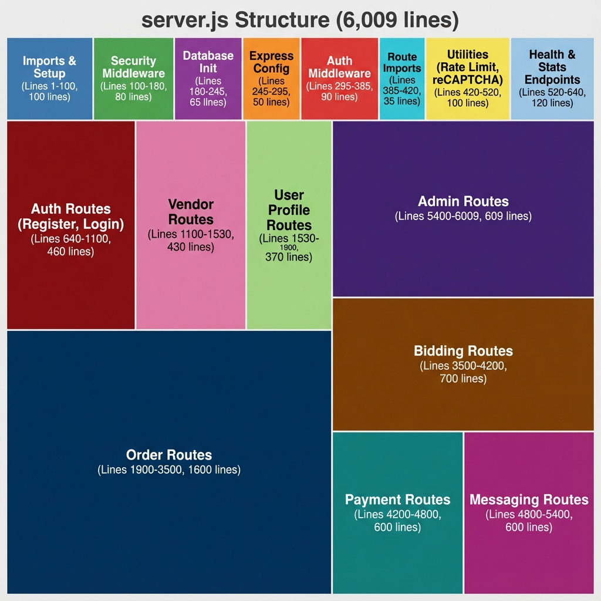

# server.js Visual Structure Analysis
## Logical Breakdown of 6,009 Lines

---

## 📊 Section Breakdown

### 🔵 Setup & Configuration (1-520) - 520 lines (8.7%)

#### 1. Imports & Setup
**Lines**: 1-100 (100 lines)  
**Purpose**: Dependencies, environment config, Sentry  
**Extraction**: ✅ Already modular  
**Priority**: P3 (Low)

#### 2. Security Middleware  
**Lines**: 100-180 (80 lines)  
**Purpose**: Helmet, CORS, sanitization setup  
**Extraction**: ✅ Already in `middleware/security.js`  
**Priority**: ✅ Done

#### 3. Database Initialization
**Lines**: 180-245 (65 lines)  
**Purpose**: `initDatabase()` function  
**Extraction**: 🔄 Move to `database/init.js`  
**Priority**: P1 (High) - **Quick Win #4**

#### 4. Express Configuration
**Lines**: 245-295 (50 lines)  
**Purpose**: Body parser, Morgan, request logging  
**Extraction**: ✅ Keep in server.js (core config)  
**Priority**: P3 (Low)

#### 5. Authentication Middleware
**Lines**: 295-385 (90 lines)  
**Purpose**: `verifyToken`, `isAdmin`, `isVendor`, etc.  
**Extraction**: 🔥 **QUICK WIN #1** → `middleware/auth.js`  
**Priority**: **P0 (Critical)**

#### 6. Route Imports
**Lines**: 385-420 (35 lines)  
**Purpose**: Loading existing route modules  
**Extraction**: ✅ Already modular  
**Priority**: P3 (Low)

#### 7. Utility Functions
**Lines**: 420-520 (100 lines)  
**Purpose**: `rateLimit()`, `verifyRecaptcha()`  
**Extraction**: 🔥 **QUICK WIN #2** → `utils/`  
**Priority**: **P0 (Critical)**

---

### 🟢 Public Endpoints (520-640) - 120 lines (2.0%)

#### 8. Health & Stats Endpoints
**Lines**: 520-640 (120 lines)  
**Routes**: `/api/health`, `/api/footer/stats`  
**Extraction**: 🔥 **QUICK WIN #3** → `routes/health.js`  
**Priority**: **P0 (Critical)**

---

### 🔴 Authentication (640-1100) - 460 lines (7.7%)

#### 9. Auth Routes
**Lines**: 640-1100 (460 lines)  
**Routes**: 
- `POST /api/auth/register` (640-841)
- `POST /api/auth/login` (843-1006)
- Other auth endpoints (1006-1100)

**Extraction**: 🔥 **QUICK WIN #6** → `routes/auth.js`  
**Priority**: **P0 (Critical)**  
**Note**: Route file exists, just move inline code

---

### 🟣 Vendor Management (1100-1530) - 430 lines (7.2%)

#### 10. Vendor Routes
**Lines**: 1100-1530 (430 lines)  
**Routes**:
- `GET /api/vendors` - List vendors
- `POST /api/vendors` - Create vendor
- `GET /api/vendors/:id` - Get vendor
- `PUT /api/vendors/:id` - Update vendor
- `DELETE /api/vendors/:id` - Delete vendor
- Vendor items management
- Vendor categories management

**Extraction**: 🔄 Create `routes/vendors.js`  
**Priority**: P1 (High)

---

### 🟡 User Profiles (1530-1900) - 370 lines (6.2%)

#### 11. User Profile Routes
**Lines**: 1530-1900 (370 lines)  
**Routes**:
- `POST /api/auth/verify-user` (1578-1620)
- `GET /api/users/:id/reputation` (1620-1686)
- `GET /api/users/:id/reviews/received` (1686-1740)
- `GET /api/users/:id/reviews/given` (1740-1793)
- `GET /api/users/me/profile` (1793-1817)
- `PUT /api/users/me/profile` (1817-1853)
- `POST /api/users/me/profile-picture` (1853-1875)
- `GET /api/users/me/preferences` (1875-1886)
- `PUT /api/users/me/preferences` (1886-1900)

**Extraction**: 🔄 Create `routes/users.js`  
**Priority**: P1 (High)

---

### 🔵 Order Management (1900-3500) - 1,600 lines (26.6%) ⚠️ LARGEST

#### 12. Order Routes
**Lines**: 1900-3500 (1,600 lines)  
**Routes**:
- `POST /api/orders` - Create order
- `GET /api/orders` - List orders
- `GET /api/orders/:id` - Get order details
- `PUT /api/orders/:id` - Update order
- `DELETE /api/orders/:id` - Delete order
- `POST /api/orders/:id/pickup` - Mark picked up
- `POST /api/orders/:id/in-transit` - Mark in transit
- `POST /api/orders/:id/complete` - Complete delivery
- `POST /api/orders/:id/location` - Update location
- `GET /api/orders/:id/tracking` - Live tracking
- Order status transitions
- Order validation logic

**Extraction**: 🔄 Create `routes/orders.js` (note: already exists but inline code here)  
**Priority**: **P0 (Critical)** - Biggest impact  
**Note**: This is the MONSTER section - 26.6% of entire file!

---

### 🟤 Bidding System (3500-4200) - 700 lines (11.7%)

#### 13. Bidding Routes
**Lines**: 3500-4200 (700 lines)  
**Routes**:
- `POST /api/orders/:id/bid` - Place bid
- `PUT /api/orders/:id/bid` - Modify bid
- `DELETE /api/orders/:id/bid` - Withdraw bid
- `POST /api/orders/:id/accept-bid` - Accept bid
- `GET /api/orders/:id/bids` - List bids
- Bid validation logic
- Bid notification triggers

**Extraction**: 🔄 Create `routes/bids.js`  
**Priority**: P1 (High)

---

### 🔷 Payments (4200-4800) - 600 lines (10.0%)

#### 14. Payment Routes
**Lines**: 4200-4800 (600 lines)  
**Routes**:
- `POST /api/payments/stripe` - Stripe payment
- `POST /api/payments/paypal` - PayPal payment
- `POST /api/payments/crypto` - Crypto payment
- `POST /api/payments/wallet` - Wallet payment
- `POST /api/payments/refund` - Process refund
- Payment verification
- Payment webhooks

**Extraction**: 🔄 Create `routes/payments.js`  
**Priority**: P1 (High)

---

### 🟣 Messaging (4800-5400) - 600 lines (10.0%)

#### 15. Messaging Routes
**Lines**: 4800-5400 (600 lines)  
**Routes**:
- `POST /api/messages` - Send message
- `GET /api/messages/:orderId` - Get messages
- `PUT /api/messages/:id/read` - Mark read
- `GET /api/notifications` - Get notifications
- `PUT /api/notifications/:id/read` - Mark notification read
- Real-time messaging logic
- Notification triggers

**Extraction**: 🔄 Create `routes/messages.js`  
**Priority**: P1 (High)

---

### 🟪 Admin Panel (5400-6009) - 609 lines (10.1%)

#### 16. Admin Routes
**Lines**: 5400-6009 (609 lines)  
**Routes**:
- User management (verify, suspend, delete)
- Order management (cancel, refund)
- System stats and analytics
- Database backup
- Revenue reports
- Admin audit logs

**Extraction**: 🔥 **QUICK WIN #5** → Refactor `admin-panel.js`  
**Priority**: **P0 (Critical)**  
**Note**: Already in separate file, just needs router pattern

---

## 📈 Size Distribution

| Category | Lines | Percentage | Priority |
|----------|-------|------------|----------|
| **Order Routes** | 1,600 | 26.6% | P0 🔥 |
| **Bidding Routes** | 700 | 11.7% | P1 |
| **Admin Routes** | 609 | 10.1% | P0 🔥 |
| **Payment Routes** | 600 | 10.0% | P1 |
| **Messaging Routes** | 600 | 10.0% | P1 |
| **Auth Routes** | 460 | 7.7% | P0 🔥 |
| **Vendor Routes** | 430 | 7.2% | P1 |
| **User Profile Routes** | 370 | 6.2% | P1 |
| **Health Endpoints** | 120 | 2.0% | P0 🔥 |
| **Utilities** | 100 | 1.7% | P0 🔥 |
| **Imports & Setup** | 100 | 1.7% | P3 |
| **Auth Middleware** | 90 | 1.5% | P0 🔥 |
| **Security Middleware** | 80 | 1.3% | ✅ Done |
| **Database Init** | 65 | 1.1% | P1 |
| **Express Config** | 50 | 0.8% | P3 |
| **Route Imports** | 35 | 0.6% | P3 |
| **TOTAL** | **6,009** | **100%** | - |

---

## 🎯 Extraction Impact Analysis

### Quick Wins (P0) - Total: 2,339 lines (38.9%)
1. ✅ Auth Middleware (90 lines)
2. ✅ Utilities (100 lines)
3. ✅ Health Endpoints (120 lines)
4. ✅ Auth Routes (460 lines)
5. ✅ Admin Routes (609 lines)
6. ✅ **Order Routes (1,600 lines)** ← BIGGEST IMPACT

**Result**: Reduce server.js from 6,009 to 3,670 lines (39% reduction)

### Phase 2 (P1) - Total: 2,700 lines (44.9%)
7. Vendor Routes (430 lines)
8. User Profile Routes (370 lines)
9. Bidding Routes (700 lines)
10. Payment Routes (600 lines)
11. Messaging Routes (600 lines)

**Result**: Reduce server.js from 3,670 to 970 lines (84% total reduction)

### Keep in server.js (P3) - Total: 970 lines (16.1%)
- Imports & Setup (100 lines)
- Express Config (50 lines)
- Route Imports (35 lines)
- Database Init (65 lines)
- Security Middleware (80 lines)
- Server startup & Socket.IO (640 lines)

**Final server.js**: ~970 lines (84% reduction from original 6,009)

---

## 🚀 Recommended Extraction Order

### Week 1: Foundation (Quick Wins)
1. **Day 1**: Auth Middleware (90) + Utilities (100) + Health (120) = 310 lines
2. **Day 2**: Auth Routes (460 lines)
3. **Day 3**: Admin Routes (609 lines)

**Week 1 Total**: 1,379 lines extracted (23% reduction)

### Week 2: The Monster
4. **Day 4-5**: Order Routes (1,600 lines) ← BIGGEST EFFORT

**Week 2 Total**: 1,600 lines extracted (27% additional reduction)

### Week 3: Remaining Routes
5. **Day 6**: Bidding Routes (700 lines)
6. **Day 7**: Payment Routes (600 lines)
7. **Day 8**: Messaging Routes (600 lines)
8. **Day 9**: Vendor Routes (430 lines)
9. **Day 10**: User Profile Routes (370 lines)

**Week 3 Total**: 2,700 lines extracted (45% additional reduction)

---

## 💡 Key Insights

1. **Order Routes are the elephant**: 1,600 lines (26.6%) - extracting this alone gives massive improvement
2. **Top 6 sections = 80%**: Focus on Order, Bidding, Admin, Payment, Messaging, Auth
3. **Quick wins available**: 1,379 lines can be extracted in 3 days
4. **Final target achievable**: 84% reduction to ~970 lines is realistic

---

**Start with the foundation (middleware, utilities) then tackle the monster (Order Routes).**
