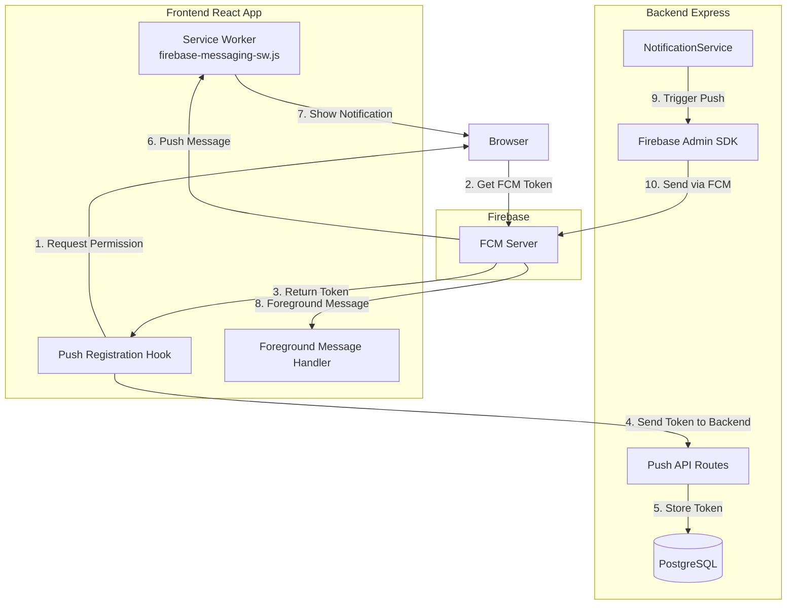

# Push Notifications Implementation Plan

**Created:** 2026-02-02  
**Status:** Draft - Awaiting Approval  
**Based on:** `DOCS/FCM_Push_Notifications_Guide.md` and `push-notifications/` configuration

---

## Executive Summary

This plan outlines the implementation of Firebase Cloud Messaging (FCM) push notifications for the Matrix Delivery platform. The system will complement the existing WebSocket-based notification service by enabling push notifications to reach users when the app is closed or in the background.

### Current State
- ✅ Firebase SDK already installed on frontend (`firebase: ^10.7.1`)
- ✅ Environment-specific Firebase configs already in `frontend/src/firebase.js`
- ✅ Existing `NotificationService` for database + WebSocket notifications
- ⚠️ Backend lacks `firebase-admin` package
- ⚠️ No FCM tokens table exists
- ⚠️ Service worker not registered for push handling

### Target State
- Push notifications work in background (closed app)
- Push notifications work in foreground (integrated with existing notification UI)
- Token management with user binding via authenticated session
- Stale token cleanup and error handling
- Support for 25+ notification types across customer/courier/admin roles

---

## Architecture Overview



---

## Current Project Analysis

### Existing Components

| Component | Status | Location |
|-----------|--------|----------|
| Firebase SDK | ✅ Installed | `frontend/package.json` |
| Firebase Config | ✅ Environment-specific | `frontend/src/firebase.js` |
| NotificationService | ✅ Exists | `backend/services/notificationService.ts` |
| NotificationPanel | ✅ Exists | `frontend/src/components/notifications/NotificationPanel.js` |
| Notifications Table | ✅ Exists | `backend/database/schema/notifications.ts` |
| Auth Middleware | ✅ Exists | JWT-based with httpOnly cookies |

### Dependencies Required

| Package | Frontend | Backend | Notes |
|---------|----------|---------|-------|
| `firebase` | ✅ 10.7.1 | ❌ | Already installed |
| `firebase-admin` | ❌ | ✅ Required | Server-side only |
| VAPID Keys | ✅ Provided | N/A | In `push-notifications/` |

### Firebase Configuration (Already Available)

The production Firebase config is already in place:
- **Project ID:** `matrix-delivery`
- **Sender ID:** `127557882021`
- **App ID:** `1:127557882021:web:f515e53b8d66547d2efd4c`
- **VAPID Public Key:** `BEpoL_cW4yUAqa_dX8zBKe5jXreLxBWSktaPy3ttIsvYecm1ng6IJAwHpO35MNsiqXUyOLiYmK-_w7q2bmJGiuc`

---

## Implementation Steps

### Phase 1: Backend Setup (Priority 1)

#### 1.1 Install Firebase Admin SDK
```bash
cd backend && npm install firebase-admin
```

#### 1.2 Create FCM Tokens Schema
File: `backend/database/schema/fcmTokens.ts`

```typescript
import { TableSchema } from '../types';

/**
 * FCM Tokens table schema
 * Stores device push notification tokens for users
 * Supports multiple tokens per user (multiple devices/browsers)
 */
export const fcmTokensSchema: TableSchema = {
    name: 'fcm_tokens',

    createStatement: `
    CREATE TABLE IF NOT EXISTS fcm_tokens (
      id SERIAL PRIMARY KEY,
      user_id VARCHAR(255) NOT NULL REFERENCES users(id),
      role VARCHAR(50) NOT NULL CHECK (role IN ('customer', 'driver', 'admin')),
      token TEXT NOT NULL UNIQUE,
      device_info VARCHAR(255),
      is_active BOOLEAN DEFAULT true,
      created_at TIMESTAMP DEFAULT CURRENT_TIMESTAMP,
      updated_at TIMESTAMP DEFAULT CURRENT_TIMESTAMP
    )
  `,

    indexes: [
        'CREATE INDEX IF NOT EXISTS idx_fcm_tokens_user_id ON fcm_tokens(user_id)',
        'CREATE INDEX IF NOT EXISTS idx_fcm_tokens_role ON fcm_tokens(role)',
        'CREATE INDEX IF NOT EXISTS idx_fcm_tokens_active ON fcm_tokens(is_active)'
    ]
};
```

#### 1.3 Create Migration File
File: `backend/migrations/20260202_create_fcm_tokens_table.sql`

```sql
-- Create FCM tokens table for push notifications
CREATE TABLE IF NOT EXISTS fcm_tokens (
  id SERIAL PRIMARY KEY,
  user_id VARCHAR(255) NOT NULL REFERENCES users(id),
  role VARCHAR(50) NOT NULL CHECK (role IN ('customer', 'driver', 'admin')),
  token TEXT NOT NULL UNIQUE,
  device_info VARCHAR(255),
  is_active BOOLEAN DEFAULT true,
  created_at TIMESTAMP DEFAULT CURRENT_TIMESTAMP,
  updated_at TIMESTAMP DEFAULT CURRENT_TIMESTAMP
);

-- Indexes for efficient lookups
CREATE INDEX IF NOT EXISTS idx_fcm_tokens_user_id ON fcm_tokens(user_id);
CREATE INDEX IF NOT EXISTS idx_fcm_tokens_role ON fcm_tokens(role);
CREATE INDEX IF NOT EXISTS idx_fcm_tokens_active ON fcm_tokens(is_active);
```

#### 1.4 Create Firebase Admin Initialization
File: `backend/config/firebase-admin.js`

```javascript
const admin = require('firebase-admin');

// Load service account from environment variable (never commit JSON to repo)
const serviceAccount = JSON.parse(process.env.FIREBASE_SERVICE_ACCOUNT_JSON || '{}');

admin.initializeApp({
    credential: admin.credential.cert(serviceAccount)
});

module.exports = admin;
```

#### 1.5 Add Environment Variables
Add to `backend/.env`:

```env
# Firebase Admin SDK Service Account (JSON string, not file path)
# Generate from: Firebase Console → Project Settings → Service Accounts
FIREBASE_SERVICE_ACCOUNT_JSON={"type":"service_account","project_id":"matrix-delivery",...}
```

#### 1.6 Create Push Notification Service
File: `backend/services/pushNotificationService.ts`

```typescript
import { Pool } from 'pg';
import admin from '../config/firebase-admin';
import { getLogger } from '../config/logger';

interface PushPayload {
    title: string;
    body: string;
    data?: Record<string, string>;
}

interface PushResult {
    success: boolean;
    tokenDeleted?: boolean;
    error?: string;
}

/**
 * PushNotificationService - Handles FCM push notifications
 */
export class PushNotificationService {
    private pool: Pool;
    private logger: any;

    constructor(pool: Pool) {
        this.pool = pool;
        this.logger = getLogger();
    }

    /**
     * Send push notification to a single token
     */
    async sendPush(token: string, payload: PushPayload): Promise<PushResult> {
        try {
            await admin.messaging().send({
                token,
                notification: {
                    title: payload.title,
                    body: payload.body
                },
                data: payload.data || {}
            });

            return { success: true };
        } catch (error: any) {
            // Handle invalid/expired tokens
            if (error.code === 'messaging/registration-token-not-registered') {
                await this.deleteToken(token);
                this.logger.warn('Deleted stale FCM token');
                return { success: false, tokenDeleted: true };
            }

            this.logger.error('FCM send error:', error);
            return { success: false, error: error.message };
        }
    }

    /**
     * Send push to all tokens for a user
     */
    async sendPushToUser(userId: string, payload: PushPayload): Promise<void> {
        const result = await this.pool.query(
            'SELECT token FROM fcm_tokens WHERE user_id = $1 AND is_active = true',
            [userId]
        );

        const results = await Promise.all(
            result.rows.map(row => this.sendPush(row.token, payload))
        );

        // Log stats
        const successful = results.filter(r => r.success).length;
        const deleted = results.filter(r => r.tokenDeleted).length;
        const failed = results.filter(r => !r.success && !r.tokenDeleted).length;

        this.logger.info('Push notification sent', {
            userId,
            successful,
            deleted,
            failed
        });
    }

    /**
     * Register a new FCM token for a user
     */
    async registerToken(userId: string, role: string, token: string, deviceInfo?: string): Promise<void> {
        await this.pool.query(`
            INSERT INTO fcm_tokens (user_id, role, token, device_info)
            VALUES ($1, $2, $3, $4)
            ON CONFLICT (token)
            DO UPDATE SET user_id = EXCLUDED.user_id,
                          role = EXCLUDED.role,
                          device_info = EXCLUDED.device_info,
                          updated_at = NOW(),
                          is_active = true
        `, [userId, role, token, deviceInfo]);

        this.logger.info('FCM token registered', { userId, role });
    }

    /**
     * Deactivate a token (on logout or explicit unregister)
     */
    async deactivateToken(token: string): Promise<void> {
        await this.pool.query(
            'UPDATE fcm_tokens SET is_active = false WHERE token = $1',
            [token]
        );
    }

    /**
     * Delete an invalid token
     */
    private async deleteToken(token: string): Promise<void> {
        await this.pool.query('DELETE FROM fcm_tokens WHERE token = $1', [token]);
    }
}

let pushServiceInstance: PushNotificationService | null = null;

export function initializePushService(pool: Pool): PushNotificationService {
    pushServiceInstance = new PushNotificationService(pool);
    return pushServiceInstance;
}

export function getPushService(): PushNotificationService {
    if (!pushServiceInstance) {
        throw new Error('PushNotificationService not initialized');
    }
    return pushServiceInstance;
}
```

#### 1.7 Create Push API Routes
File: `backend/routes/push.js`

```javascript
const express = require('express');
const router = express.Router();
const { requireAuth } = require('../middleware/auth');
const { getPushService } = require('../services/pushNotificationService');

/**
 * POST /api/push/register
 * Register FCM token for authenticated user
 * 
 * Security: CSRF protected via app.use('/api', csrfMiddleware) in app.js
 * The frontend api.js already handles CSRF token automatically
 */
router.post('/register', requireAuth, async (req, res) => {
    try {
        const { token, deviceInfo } = req.body;
        const userId = req.user.id;
        const role = req.user.role;

        if (!token || typeof token !== 'string') {
            return res.status(400).json({ error: 'token is required' });
        }

        const pushService = getPushService();
        await pushService.registerToken(userId, role, token, deviceInfo);

        res.json({ ok: true });
    } catch (error) {
        console.error('Token registration error:', error);
        res.status(500).json({ error: 'Failed to register token' });
    }
});

/**
 * POST /api/push/unregister
 * Deactivate FCM token (on logout)
 */
router.post('/unregister', requireAuth, async (req, res) => {
    try {
        const { token } = req.body;

        if (!token) {
            return res.status(400).json({ error: 'token is required' });
        }

        const pushService = getPushService();
        await pushService.deactivateToken(token);

        res.json({ ok: true });
    } catch (error) {
        console.error('Token unregistration error:', error);
        res.status(500).json({ error: 'Failed to unregister token' });
    }
});

module.exports = router;
```

#### 1.8 Register Routes in server.js
Add to `backend/server.js`:

```javascript
const pushRoutes = require('./routes/push');
app.use('/api/push', pushRoutes);
```

---

### Phase 2: Frontend Setup (Priority 2)

**Note:** The frontend API client (`frontend/src/api.js`) already has built-in CSRF token handling. The `api.post()` method automatically:
1. Fetches CSRF token from `/api/csrf-token`
2. Includes it in the `X-CSRF-Token` header
3. Retries once on 403 responses

No additional CSRF handling is required in the push notification hooks.

#### 2.1 Create Firebase Messaging Hook
File: `frontend/src/hooks/usePushNotifications.ts`

```typescript
import { useCallback, useEffect, useState } from 'react';
import { getToken, onMessage } from 'firebase/messaging';
import { messaging } from '../firebase';
import api from '../api';

interface PushRegistrationResult {
    success: boolean;
    token?: string;
    error?: string;
}

export function usePushNotifications(): {
    registerForPush: () => Promise<PushRegistrationResult>;
    unregisterFromPush: () => Promise<void>;
    isSupported: boolean;
    permission: NotificationPermission;
} {
    const [permission, setPermission] = useState<NotificationPermission>('default');
    const [isSupported, setIsSupported] = useState(false);

    useEffect(() => {
        // Check if notifications are supported
        if ('Notification' in window && 'serviceWorker' in navigator) {
            setIsSupported(true);
            setPermission(Notification.permission);
        }
    }, []);

    const registerForPush = useCallback(async (): Promise<PushRegistrationResult> => {
        try {
            // Request permission
            const perm = await Notification.requestPermission();
            setPermission(perm);

            if (perm !== 'granted') {
                return { success: false, error: 'Permission denied' };
            }

            // Get FCM token
            const token = await getToken(messaging, {
                vapidKey: process.env.REACT_APP_VAPID_PUBLIC_KEY
            });

            if (!token) {
                return { success: false, error: 'No token returned' };
            }

            // Send to backend
            await api.post('/api/push/register', { token });

            return { success: true, token };
        } catch (error: any) {
            console.error('Push registration error:', error);
            return { success: false, error: error.message };
        }
    }, []);

    const unregisterFromPush = useCallback(async (): Promise<void> => {
        try {
            const token = await getToken(messaging, {
                vapidKey: process.env.REACT_APP_VAPID_PUBLIC_KEY
            }).catch(() => null);

            if (token) {
                await api.post('/api/push/unregister', { token });
            }
        } catch (error) {
            console.error('Push unregistration error:', error);
        }
    }, []);

    return { registerForPush, unregisterFromPush, isSupported, permission };
}
```

#### 2.2 Create Foreground Message Handler
File: `frontend/src/hooks/useForegroundMessages.ts`

```typescript
import { useEffect } from 'react';
import { onMessage } from 'firebase/messaging';
import { messaging } from '../firebase';
import { toast } from 'react-hot-toast'; // or your toast library

interface ForegroundMessage {
    title?: string;
    body?: string;
    data?: Record<string, string>;
}

export function useForegroundMessages(onMessageCallback?: (message: ForegroundMessage) => void) {
    useEffect(() => {
        const unsubscribe = onMessage(messaging, (payload) => {
            const { title, body } = payload.notification || {};
            const data = payload.data || {};

            console.log('Foreground push received:', payload);

            // Call the callback if provided
            if (onMessageCallback) {
                onMessageCallback({ title, body, data });
            }

            // Show toast notification
            if (title && body) {
                toast(title, {
                    description: body,
                    icon: '🔔'
                });
            }

            // Handle specific message types
            if (data.type === 'ORDER_ASSIGNED') {
                // Navigate to order details or refresh orders list
                window.dispatchEvent(new CustomEvent('order:assigned', { detail: data }));
            }

            if (data.type === 'NEW_MESSAGE') {
                // Refresh messages or show chat notification
                window.dispatchEvent(new CustomEvent('chat:message', { detail: data }));
            }
        });

        return () => unsubscribe();
    }, [onMessageCallback]);
}
```

#### 2.3 Create Service Worker File
File: `frontend/public/firebase-messaging-sw.js`

```javascript
// firebase-messaging-sw.js
// ⚠️  Keep this version in sync with firebase package version
//      Current: 10.7.1 — update both when upgrading

importScripts('https://www.gstatic.com/firebasejs/10.7.1/firebase-app-compat.js');
importScripts('https://www.gstatic.com/firebasejs/10.7.1/firebase-messaging-compat.js');

firebase.initializeApp({
    apiKey: process.env.REACT_APP_FIREBASE_API_KEY,
    authDomain: process.env.REACT_APP_FIREBASE_AUTH_DOMAIN,
    projectId: process.env.REACT_APP_FIREBASE_PROJECT_ID,
    storageBucket: process.env.REACT_APP_FIREBASE_STORAGE_BUCKET,
    messagingSenderId: process.env.REACT_APP_FIREBASE_MESSAGING_SENDER_ID,
    appId: process.env.REACT_APP_FIREBASE_APP_ID
});

const messaging = firebase.messaging();

// Handle background messages
messaging.onBackgroundMessage((payload) => {
    const data = payload.data || {};

    console.log('Background push received:', payload);

    // Show notification
    if (payload.notification) {
        self.registration.showNotification(
            payload.notification.title,
            {
                body: payload.notification.body,
                icon: '/icon.png', // Add your icon to public folder
                data: data,
                actions: [
                    {
                        action: 'view',
                        title: 'View'
                    },
                    {
                        action: 'dismiss',
                        title: 'Dismiss'
                    }
                ]
            }
        );
    }

    // Handle data-only messages
    if (data.type === 'ORDER_UPDATE') {
        // Trigger background sync without notification
        // Use event.waitUntil if you need the SW to stay alive
    }
});

// Handle notification click
self.addEventListener('notificationclick', (event) => {
    const data = event.notification.data || {};

    event.notification.close();

    if (event.action === 'dismiss') {
        return;
    }

    // Open the app to the relevant page
    event.waitUntil(
        clients.matchAll({ type: 'window', includeUncontrolled: true }).then((clientList) => {
            // If app is already open, focus it
            for (const client of clientList) {
                if (client.url.includes(self.location.origin) && 'focus' in client) {
                    client.focus();
                    // Send message to the client about the notification
                    client.postMessage({ type: 'NOTIFICATION_CLICK', data });
                    return;
                }
            }

            // If app is not open, open it
            if (clients.openWindow) {
                const url = new URL(self.location.origin);
                
                if (data.orderId) {
                    url.pathname = `/orders/${data.orderId}`;
                } else if (data.type === 'NEW_MESSAGE') {
                    url.pathname = '/messages';
                }

                return clients.openWindow(url.toString());
            }
        })
    );
});
```

#### 2.4 Register Service Worker in index.js
Add to `frontend/src/index.js`:

```javascript
// Register service worker for push notifications
if ('serviceWorker' in navigator) {
    navigator.serviceWorker
        .register('/firebase-messaging-sw.js')
        .then((registration) => {
            console.log('Service Worker registered:', registration.scope);
        })
        .catch((err) => {
            console.error('Service Worker registration failed:', err);
        });
}
```

#### 2.5 Add VAPID Key to Environment
Add to `frontend/.env.production`:

```env
REACT_APP_VAPID_PUBLIC_KEY=BEpoL_cW4yUAqa_dX8zBKe5jXreLxBWSktaPy3ttIsvYecm1ng6IJAwHpO35MNsiqXUyOLiYmK-_w7q2bmJGiuc
```

Add to other environment files as needed.

---

### Phase 3: Integration with Existing Services (Priority 3)

#### 3.1 Extend NotificationService for Push
File: `backend/services/notificationService.ts`

Add push notification trigger to `createNotification`:

```typescript
import { getPushService } from './pushNotificationService';

export class NotificationService {
    // ... existing code ...

    async createNotification(params: CreateNotificationParams): Promise<NotificationRecord | null> {
        const { userId, orderId, type, title, message } = params;

        try {
            // Create in database (existing code)
            const result = await this.pool.query<NotificationRecord>(...);
            const notification = result.rows[0];

            // Emit via WebSocket (existing code)
            if (this.io) {
                this.io.to(`user_${userId}`).emit('notification', {...});
            }

            // NEW: Send push notification
            try {
                const pushService = getPushService();
                await pushService.sendPushToUser(userId, {
                    title,
                    body: message,
                    data: {
                        type,
                        orderId: orderId || '',
                        notificationId: String(notification.id)
                    }
                });
            } catch (pushError) {
                this.logger.error('Push notification failed:', pushError);
                // Don't fail the main operation if push fails
            }

            return notification;
        } catch (error) {
            this.logger.error('Error creating notification:', error);
            return null;
        }
    }
}
```

#### 3.2 Add Push Toggle to Notification Types
Create notification type config in `backend/config/notificationTypes.js`:

```javascript
module.exports = {
    // Push notification configuration per type
    pushEnabled: {
        ORDER_PLACED: { customer: true, driver: false, admin: true },
        ORDER_ASSIGNED: { customer: false, driver: true, admin: false },
        ORDER_STATUS_UPDATE: { customer: true, driver: true, admin: false },
        COURIER_ARRIVED: { customer: true, driver: false, admin: false },
        ORDER_COMPLETED: { customer: true, driver: true, admin: false },
        NEW_MESSAGE: { customer: true, driver: true, admin: false },
        EMERGENCY_ALERT: { customer: false, driver: true, admin: true },
        PAYMENT_RECEIVED: { customer: true, driver: false, admin: false },
        BALANCE_LOW: { customer: true, driver: true, admin: false }
    }
};
```

---

### Phase 4: Frontend Integration (Priority 4)

#### 4.1 Create Push Permission Request Component
File: `frontend/src/components/push/PushNotificationPermission.tsx`

```typescript
import React from 'react';
import { usePushNotifications } from '../../hooks/usePushNotifications';
import { useI18n } from '../../i18n/i18nContext';

interface Props {
    onComplete?: () => void;
}

export const PushNotificationPermission: React.FC<Props> = ({ onComplete }) => {
    const { t } = useI18n();
    const { registerForPush, unregisterFromPush, isSupported, permission } = usePushNotifications();

    const handleEnable = async () => {
        const result = await registerForPush();
        if (result.success) {
            onComplete?.();
        }
    };

    const handleDisable = async () => {
        await unregisterFromPush();
    };

    if (!isSupported) {
        return null; // Push not supported
    }

    if (permission === 'granted') {
        return (
            <button 
                data-testid="push-notification-enabled"
                onClick={handleDisable}
                className="btn-secondary"
            >
                {t('pushNotifications.enabled')}
            </button>
        );
    }

    return (
        <button 
            data-testid="push-notification-enable-button"
            onClick={handleEnable}
            className="btn-primary"
        >
            {t('pushNotifications.enable')}
        </button>
    );
};

export default PushNotificationPermission;
```

#### 4.2 Integrate with Settings Page
Add push notification toggle to user settings.

#### 4.3 Integrate with Main App
Update `frontend/src/App.js`:

```javascript
import { usePushNotifications } from './hooks/usePushNotifications';
import { useForegroundMessages } from './hooks/useForegroundMessages';

function App() {
    const { registerForPush, permission } = usePushNotifications();
    const { addMessage } = useNotificationsStore(); // Your existing store

    useForegroundMessages((message) => {
        // Add to existing notification store for UI display
        addMessage({
            title: message.title,
            body: message.body,
            data: message.data
        });
    });

    // Register for push on login/app start
    useEffect(() => {
        if (permission === 'default') {
            // Auto-register on app start (will show permission prompt)
            registerForPush();
        }
    }, [permission]);

    // ... rest of App
}
```

---

### Phase 5: Testing (Priority 5)

#### 5.1 Backend Tests
File: `backend/__tests__/push-notifications.test.js`

```javascript
describe('Push Notification Service', () => {
    // Test token registration
    // Test push sending
    // Test stale token cleanup
    // Test error handling
});
```

#### 5.2 Frontend Tests
File: `frontend/src/__tests__/push-notifications.test.js`

```javascript
describe('Push Notifications', () => {
    // Test permission request
    // Test token retrieval
    // Test foreground message handling
    // Test service worker registration
});
```

#### 5.3 Manual Testing Checklist
- [ ] Register for push on Chrome
- [ ] Receive push when app is closed
- [ ] Receive push when app is in foreground
- [ ] Test notification click handler
- [ ] Test token rotation handling
- [ ] Test logout cleanup
- [ ] Test stale token deletion

---

### Phase 6: Security & Production Readiness (Priority 6)

#### 6.1 Security Measures

| Measure | Implementation |
|---------|----------------|
| Token Binding | Tokens bound to authenticated user via JWT |
| Token Validation | Validate token format and length on backend |
| Per-User Rate Limiting | Limit push attempts per user |
| Stale Token Cleanup | Automatic deletion of invalid tokens |
| Environment Isolation | Separate Firebase projects per environment |
| Sensitive Data | Never log full FCM tokens |

#### 6.2 Environment Configuration

| Environment | Firebase Project | VAPID Key |
|-------------|------------------|-----------|
| Development | matrix-delivery-dev | Separate dev key |
| Staging | matrix-delivery-staging | Separate staging key |
| Production | matrix-delivery | Production key |

#### 6.3 Monitoring & Logging

- Log push notification success/failure per user
- Track stale token cleanup events
- Monitor push notification delivery rate
- Set up alerts for high failure rates

---

## Notification Types Matrix

| Event | Customer | Driver | Admin | Push Enabled |
|-------|----------|--------|-------|--------------|
| Order Placed | ✅ | ❌ | ✅ | ✅ |
| Order Assigned | ❌ | ✅ | ❌ | ✅ |
| Order Status Update | ✅ | ✅ | ❌ | ✅ |
| Courier Arrived | ✅ | ❌ | ❌ | ✅ |
| Order Completed | ✅ | ✅ | ❌ | ✅ |
| New Message | ✅ | ✅ | ❌ | ✅ |
| Payment Received | ✅ | ❌ | ❌ | ✅ |
| Emergency Alert | ❌ | ✅ | ✅ | ✅ |
| Balance Low | ✅ | ✅ | ❌ | ❌ |
| New Review | ✅ | ✅ | ❌ | ❌ |

---

## Rollout Plan

### Phase 1: Backend (Day 1-2)
1. Install `firebase-admin`
2. Create database schema and migration
3. Implement push service
4. Add API routes
5. Unit tests

### Phase 2: Frontend Core (Day 2-3)
1. Service worker setup
2. Push registration hook
3. Foreground message handler
4. Component integration

### Phase 3: Integration (Day 3-4)
1. Connect with existing NotificationService
2. Add notification type configuration
3. Update frontend components

### Phase 4: Testing (Day 4-5)
1. Integration tests
2. Manual testing
3. Bug fixes

### Phase 5: Production (Day 5-6)
1. Environment configuration
2. Security review
3. Monitoring setup
4. Deploy to staging
5. Deploy to production

---

## Files to Create/Modify

### New Files

| File | Type | Location |
|------|------|----------|
| `firebase-admin.js` | Backend | `backend/config/` |
| `pushNotificationService.ts` | Backend | `backend/services/` |
| `fcmTokens.ts` | Backend Schema | `backend/database/schema/` |
| `push.js` | Backend Route | `backend/routes/` |
| `20260202_create_fcm_tokens_table.sql` | Migration | `backend/migrations/` |
| `usePushNotifications.ts` | Frontend Hook | `frontend/src/hooks/` |
| `useForegroundMessages.ts` | Frontend Hook | `frontend/src/hooks/` |
| `firebase-messaging-sw.js` | Service Worker | `frontend/public/` |
| `PushNotificationPermission.tsx` | Frontend Component | `frontend/src/components/push/` |

### Modified Files

| File | Changes |
|------|---------|
| `backend/package.json` | Add `firebase-admin` |
| `backend/.env` | Add `FIREBASE_SERVICE_ACCOUNT_JSON` |
| `backend/server.js` | Add push routes import |
| `backend/services/notificationService.ts` | Integrate push service |
| `backend/database/schema/index.ts` | Register fcmTokens schema |
| `frontend/src/index.js` | Register service worker |
| `frontend/.env.production` | Add VAPID key |
| `frontend/src/App.js` | Initialize foreground listener |
| `frontend/src/firebase.js` | Export messaging instance |

---

## Risk Mitigation

| Risk | Mitigation |
|------|------------|
| Safari doesn't support FCM | Document limitation, consider APNs for future |
| Tokens not working on HTTP | Only works on HTTPS, document requirement |
| High notification failure rate | Automatic stale token cleanup |
| Permission prompt fatigue | Auto-request after login, not on page load |
| Multiple tokens per user | Support one-to-many relationship in DB |
| Token rotation | Re-register on visibility change and service worker update |

---

## Dependencies on Other Work

- None - can start immediately
- Uses existing authentication system (JWT)
- Uses existing database connection pool
- Uses existing notification infrastructure

---

## Approval Required

Please review this plan and confirm:

1. ✅ Architecture looks correct
2. ✅ File locations follow project conventions
3. ✅ Security measures are adequate
4. ✅ Notification types match business requirements
5. ✅ Rollout timeline is acceptable

**Next Step:** Switch to Code mode to begin implementation.
